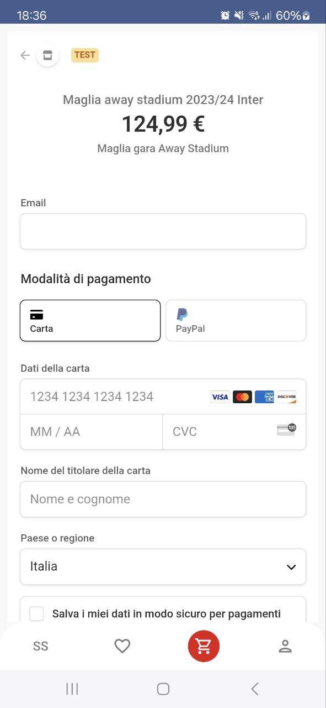

  <h1>ScoreStripes</h1>

 ScoreStripes è un'applicazione enterprise per la vendita di prodotti sportivi, al momento disponibile come app android.

<h4> Link al figma: <a href="https://www.figma.com/design/1WAcUT4OLB5ZNfsRNZ1b6V/Untitled?node-id=0-1&t=aiDi0i26RPZYNtDe-1">Figma</a> <t> Password:EA</h4>
<h2> Divisione del lavoro </h2>

    

<ul>
    <li> 
        <h3>Francesco Gallo</h3>
        Responsabile di tutto il server utilizzando il framework Spring Boot. 
        Fix di bug, testing e supporto nei client Android. 
        (Nel progetto si trova anche una cartella che contiene funzionalità tramite programmazione reattiva con Spring WebFlux e MongoDB, non completata e implementata con il resto per mancanza di tempo). 
        Tra le varie cose, si sottolineano:
        <ul>
            <li> <h4>Auditing</h4> </li>
            <li> <h4>Custom Rate limiting usando il paradigma AOP</h4> </li>
            <li> <h4>Custom Validators</h4> </li>
            <li> <h4><a href="Documentazione API con Swagger">Documentazione API con Swagger</a></h4> </li>
            <li> <h4>Uso di HTTPS</h4> </li>
            <li> <h4>Uso di AWS S3 e presigned URL per lo storage delle immagini</h4> </li>
            <li> <h4>Auto DB cleaning per i token scaduti</h4> </li>
            <li> 
                <h4>Pagamenti tramite <a href="https://stripe.com/">Stripe</a></h4>
                
            </li>
            <li> <h4>Invio mail con template</h4> </li>
        </ul>
    </li>
     
    <li> 
        <h3>Francesco Cavaliere</h3>
        Responsabile della la logica del client Customer, login, register e logout in entrambi i client. Collaborazione nella parte di autorizzazione, autenticazione e nel client Admin.  
        Sviluppato alcuni endpoint REST.  
        Tra le varie cose, si sottolineano:
        <ul>
            <li> <h4>Gestione delle wishlist, carrello e viewmodels del client Admin</h4> </li>
        </ul>
    </li>
     
    <li> 
        <h3>Aldo Gioia</h3>
        Responsabile del design e implementazione di ogni schermata per entrambi i client (UI/UX). 
        Gestione di quasi tutti i FormViewModels e di molti ViewModels nel client Admin. 
        Tra le varie cose si sottolineano:
        <ul>
            <li> <h4>Configurazione di Retrofit per le chiamate REST</h4> </li>
            <li> <h4>Configurazione di Moshi e MoshiCodeGen per la serializzazione e deserializzazione</h4> </li>
            <li> <h4>Uso del CompositionLocal per la gestione dei ViewModels</h4> </li>
        </ul>
    </li>
</ul>
